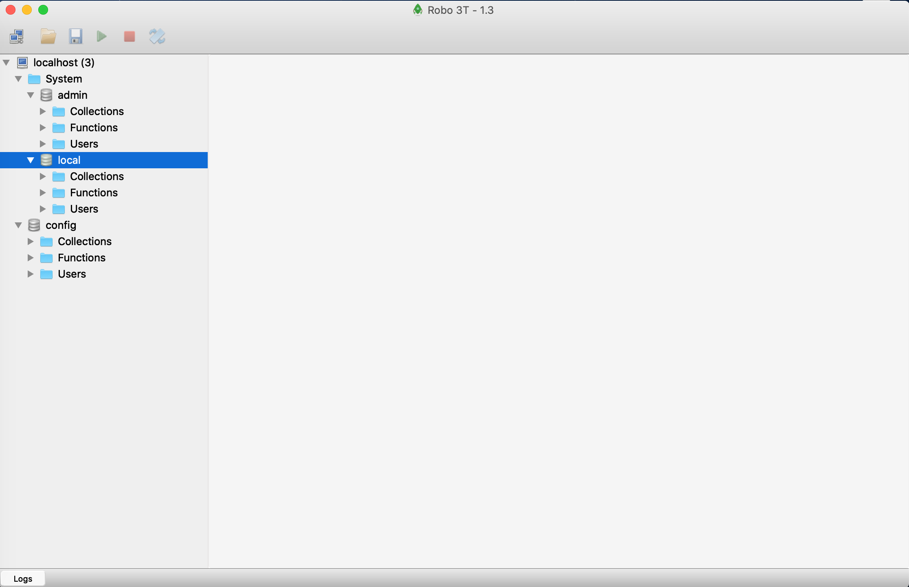

# Session 10: [Hands-On] CRUD API with MongoDB 

---

## 51. Instal MongoDB

### 51.1. gRPC CRUD with MongoDB

* section overview:
  * we'll implement a "blog" service in which we'll
    * Create
    * Read
    * Update
    * Delete
  * blogs, using [MongoDB](https://www.mongodb.com/) as a backend
  * No MongoDB knowledge is needed for this section
  * You could replace MongoDB by your favourite database as an exercise

* MongoDB Community Server: [link](https://www.mongodb.com/download-center/community)
* MongoDB MacOS installation: [docs](https://docs.mongodb.com/manual/tutorial/install-mongodb-on-os-x/)

Shortly, let's do this command:

```bash
brew tap mongodb/brew
brew install mongodb-community@4.2
```

run `mongod`

```bash
$ mongod
2020-03-30T00:41:03.430+0900 I  CONTROL  [main] Automatically disabling TLS 1.0, to force-enable TLS 1.0 specify --sslDisabledProtocols 'none'
2020-03-30T00:41:03.433+0900 I  CONTROL  [initandlisten] MongoDB starting : pid=55207 port=27017 dbpath=/data/db 64-bit host=Marks-MacBook-Pro.local
2020-03-30T00:41:03.433+0900 I  CONTROL  [initandlisten] db version v4.2.3
2020-03-30T00:41:03.433+0900 I  CONTROL  [initandlisten] git version: 6874650b362138df74be53d366bbefc321ea32d4
2020-03-30T00:41:03.433+0900 I  CONTROL  [initandlisten] allocator: system
2020-03-30T00:41:03.433+0900 I  CONTROL  [initandlisten] modules: none
2020-03-30T00:41:03.433+0900 I  CONTROL  [initandlisten] build environment:
2020-03-30T00:41:03.433+0900 I  CONTROL  [initandlisten]     distarch: x86_64
2020-03-30T00:41:03.433+0900 I  CONTROL  [initandlisten]     target_arch: x86_64
2020-03-30T00:41:03.433+0900 I  CONTROL  [initandlisten] options: {}
2020-03-30T00:41:03.434+0900 I  STORAGE  [initandlisten] exception in initAndListen: NonExistentPath: Data directory /data/db not found., terminating
2020-03-30T00:41:03.434+0900 I  NETWORK  [initandlisten] shutdown: going to close listening sockets...
2020-03-30T00:41:03.434+0900 I  -        [initandlisten] Stopping further Flow Control ticket acquisitions.
2020-03-30T00:41:03.434+0900 I  CONTROL  [initandlisten] now exiting
2020-03-30T00:41:03.434+0900 I  CONTROL  [initandlisten] shutting down with code:100
```

and we got some errors:

```bash
2020-03-30T00:41:03.434+0900 I  STORAGE  [initandlisten] exception in initAndListen: NonExistentPath: Data directory /data/db not found., terminating
```

this means that `mongodb` cannot find the Data directory `/data/db` which is set as default path.  

you can check this by running this command:

```bash
$ mongod dbpath
2020-03-30T00:57:56.044+0900 I  CONTROL  [main] Automatically disabling TLS 1.0, to force-enable TLS 1.0 specify --sslDisabledProtocols 'none'
/data/db
```

so what we can do is:

* create `~/data/db`
  
  ```bash
  mkdir -pv ~/data/db
  ```

* set `~/data/db` as data directory

  ```bash
  mongod --dbpath ~/data/db
  ```

now, run it again with `mongod --dbpath ~data/db

```bash
$ mongod --dbpath ~/data/db
2020-03-30T00:59:29.858+0900 I  CONTROL  [main] Automatically disabling TLS 1.0, to force-enable TLS 1.0 specify --sslDisabledProtocols 'none'
2020-03-30T00:59:29.861+0900 I  CONTROL  [initandlisten] MongoDB starting : pid=61169 port=27017 dbpath=data/db 64-bit host=Juns-MacBook-Pro.local
2020-03-30T00:59:29.861+0900 I  CONTROL  [initandlisten] db version v4.2.3
2020-03-30T00:59:29.861+0900 I  CONTROL  [initandlisten] git version: 6874650b362138df74be53d366bbefc321ea32d4
2020-03-30T00:59:29.861+0900 I  CONTROL  [initandlisten] allocator: system
2020-03-30T00:59:29.861+0900 I  CONTROL  [initandlisten] modules: none
2020-03-30T00:59:29.861+0900 I  CONTROL  [initandlisten] build environment:
2020-03-30T00:59:29.861+0900 I  CONTROL  [initandlisten]     distarch: x86_64
2020-03-30T00:59:29.861+0900 I  CONTROL  [initandlisten]     target_arch: x86_64
2020-03-30T00:59:29.861+0900 I  CONTROL  [initandlisten] options: { storage: { dbPath: "data/db" } }
2020-03-30T00:59:29.862+0900 I  STORAGE  [initandlisten] wiredtiger_open config: create,cache_size=7680M,cache_overflow=(file_max=0M),session_max=33000,eviction=(threads_min=4,threads_max=4),config_base=false,statistics=(fast),log=(enabled=true,archive=true,path=journal,compressor=snappy),file_manager=(close_idle_time=100000,close_scan_interval=10,close_handle_minimum=250),statistics_log=(wait=0),verbose=[recovery_progress,checkpoint_progress],
2020-03-30T00:59:30.521+0900 I  STORAGE  [initandlisten] WiredTiger message [1585497570:521444][61169:0x1100f7dc0], txn-recover: Set global recovery timestamp: (0, 0)
2020-03-30T00:59:30.599+0900 I  RECOVERY [initandlisten] WiredTiger recoveryTimestamp. Ts: Timestamp(0, 0)
2020-03-30T00:59:30.660+0900 I  STORAGE  [initandlisten] Timestamp monitor starting
2020-03-30T00:59:30.662+0900 I  CONTROL  [initandlisten]
2020-03-30T00:59:30.662+0900 I  CONTROL  [initandlisten] ** WARNING: Access control is not enabled for the database.
2020-03-30T00:59:30.662+0900 I  CONTROL  [initandlisten] **          Read and write access to data and configuration is unrestricted.
2020-03-30T00:59:30.662+0900 I  CONTROL  [initandlisten]
2020-03-30T00:59:30.662+0900 I  CONTROL  [initandlisten] ** WARNING: This server is bound to localhost.
2020-03-30T00:59:30.662+0900 I  CONTROL  [initandlisten] **          Remote systems will be unable to connect to this server.
2020-03-30T00:59:30.662+0900 I  CONTROL  [initandlisten] **          Start the server with --bind_ip <address> to specify which IP
2020-03-30T00:59:30.662+0900 I  CONTROL  [initandlisten] **          addresses it should serve responses from, or with --bind_ip_all to
2020-03-30T00:59:30.663+0900 I  CONTROL  [initandlisten] **          bind to all interfaces. If this behavior is desired, start the
2020-03-30T00:59:30.663+0900 I  CONTROL  [initandlisten] **          server with --bind_ip 127.0.0.1 to disable this warning.
2020-03-30T00:59:30.663+0900 I  CONTROL  [initandlisten]
2020-03-30T00:59:30.663+0900 I  CONTROL  [initandlisten]
2020-03-30T00:59:30.663+0900 I  CONTROL  [initandlisten] ** WARNING: soft rlimits too low. Number of files is 256, should be at least 1000
2020-03-30T00:59:30.664+0900 I  STORAGE  [initandlisten] createCollection: admin.system.version with provided UUID: 7070d56b-aff6-4ef9-8618-696ac37acce9 and options: { uuid: UUID("7070d56b-aff6-4ef9-8618-696ac37acce9") }
2020-03-30T00:59:30.714+0900 I  INDEX    [initandlisten] index build: done building index _id_ on ns admin.system.version
2020-03-30T00:59:30.715+0900 I  SHARDING [initandlisten] Marking collection admin.system.version as collection version: <unsharded>
2020-03-30T00:59:30.715+0900 I  COMMAND  [initandlisten] setting featureCompatibilityVersion to 4.2
2020-03-30T00:59:30.715+0900 I  SHARDING [initandlisten] Marking collection local.system.replset as collection version: <unsharded>
2020-03-30T00:59:30.716+0900 I  STORAGE  [initandlisten] Flow Control is enabled on this deployment.
2020-03-30T00:59:30.716+0900 I  SHARDING [initandlisten] Marking collection admin.system.roles as collection version: <unsharded>
2020-03-30T00:59:30.716+0900 I  STORAGE  [initandlisten] createCollection: local.startup_log with generated UUID: ad6e0525-79bb-42b8-8dde-1ef02ae82944 and options: { capped: true, size: 10485760 }
2020-03-30T00:59:30.762+0900 I  INDEX    [initandlisten] index build: done building index _id_ on ns local.startup_log
2020-03-30T00:59:30.762+0900 I  SHARDING [initandlisten] Marking collection local.startup_log as collection version: <unsharded>
2020-03-30T00:59:30.762+0900 I  FTDC     [initandlisten] Initializing full-time diagnostic data capture with directory 'data/db/diagnostic.data'
2020-03-30T00:59:30.764+0900 I  SHARDING [LogicalSessionCacheRefresh] Marking collection config.system.sessions as collection version: <unsharded>
2020-03-30T00:59:30.764+0900 I  NETWORK  [listener] Listening on /tmp/mongodb-27017.sock
2020-03-30T00:59:30.764+0900 I  NETWORK  [listener] Listening on 127.0.0.1
2020-03-30T00:59:30.764+0900 I  CONTROL  [LogicalSessionCacheReap] Sessions collection is not set up; waiting until next sessions reap interval: config.system.sessions does not exist
2020-03-30T00:59:30.764+0900 I  NETWORK  [listener] waiting for connections on port 27017
2020-03-30T00:59:30.764+0900 I  STORAGE  [LogicalSessionCacheRefresh] createCollection: config.system.sessions with provided UUID: e7546955-0fc0-4b38-9ebd-4a6d8be41db1 and options: { uuid: UUID("e7546955-0fc0-4b38-9ebd-4a6d8be41db1") }
2020-03-30T00:59:30.809+0900 I  INDEX    [LogicalSessionCacheRefresh] index build: done building index _id_ on ns config.system.sessions
2020-03-30T00:59:30.880+0900 I  INDEX    [LogicalSessionCacheRefresh] index build: starting on config.system.sessions properties: { v: 2, key: { lastUse: 1 }, name: "lsidTTLIndex", ns: "config.system.sessions", expireAfterSeconds: 1800 } using method: Hybrid
2020-03-30T00:59:30.880+0900 I  INDEX    [LogicalSessionCacheRefresh] build may temporarily use up to 200 megabytes of RAM
2020-03-30T00:59:30.880+0900 I  INDEX    [LogicalSessionCacheRefresh] index build: collection scan done. scanned 0 total records in 0 seconds
2020-03-30T00:59:30.881+0900 I  INDEX    [LogicalSessionCacheRefresh] index build: inserted 0 keys from external sorter into index in 0 seconds
2020-03-30T00:59:30.891+0900 I  INDEX    [LogicalSessionCacheRefresh] index build: done building index lsidTTLIndex on ns config.system.sessions
2020-03-30T00:59:30.902+0900 I  COMMAND  [LogicalSessionCacheRefresh] command config.system.sessions command: createIndexes { createIndexes: "system.sessions", indexes: [ { key: { lastUse: 1 }, name: "lsidTTLIndex", expireAfterSeconds: 1800 } ], $db: "config" } numYields:0 reslen:114 locks:{ ParallelBatchWriterMode: { acquireCount: { r: 2 } }, ReplicationStateTransition: { acquireCount: { w: 3 } }, Global: { acquireCount: { r: 1, w: 2 } }, Database: { acquireCount: { r: 1, w: 2, W: 1 } }, Collection: { acquireCount: { r: 4, w: 1, R: 1, W: 2 } }, Mutex: { acquireCount: { r: 3 } } } flowControl:{ acquireCount: 1 } storage:{} protocol:op_msg 138ms
2020-03-30T00:59:31.002+0900 I  SHARDING [ftdc] Marking collection local.oplog.rs as collection version: <unsharded>
```

Thus, we can successfully run the MongoDB.

---

## 52. Instal MongoDB - Windows Instruction

* Install MongoDB on Windows
  * If you're having issues, please look at these tutorials:
    * https://docs.mongodb.com/manual/tutorial/install-mongodb-on-windows/
    * https://treehouse.github.io/installation-guides/windows/mongo-windows.html
  * If you want to use a custom data directory
    * Create C:/database_mongo
    * mongod --dbpath=C:/database_mongo/

---

## 53. Instal MongoDB UI - Robo 3T

* robomongo renamed as Robo 3T
  * download: [link](https://robomongo.org/download)

* after the app installed:
  * open the app
  * create connection with this spec:
    * Type: Direct Connection
    * Name: localhost
    * Address: localhost:27017
  * click the "test" button at bottom left
    * you will get this message:
      * Connected to **localhost:27017**
      * Access to databases is available
  * save this setting
  * and now you are ready to connect.



---

## 54. Blog Service Golang Setup

### 54.1. Project Structure

* create directory like this:

```note
blog
  blog_client
    client.go
  blog_server
    server.go
  blog_pb
    blog.proto

calculator
  ...

greet
  ...

ssl
  ...
---

with this:

```bash
mkdir -pv blog/blog_client blog/blog_server blog/blogpb
```

### 54.2. Protobuf Definition

at the `blog/blogpb/blog.proto`, let's define the protobuf like below

```proto
syntax = "proto3";

package blog;

option go_package = "blogpb";

message Blog {
  string id = 1;
  string author_id = 2;
  string title = 3;
  string content = 4;
}

service BlogService {
  
}
```

and generate the code:

```bash
protoc blog/blogpb/blog.proto --go_out=plugins=grpc:.
```

and we get `blog/blogpb/blog.pb.go` file.

### 54.3. Server

We have `blog/blog_server/server.go` and it's empty file now.
What we want to do is:

* this time, we want to properly close the server
* modify to our blog service

so, first the simple code of the `server.go` looks like this:

```go
package main

import (
  "fmt"
  "log"
  "net"

  "google.golang.org/grpc"

  "../blogpb"
)

type server struct{
}

func main() {
  fmt.Println("Blog Service Started")

  lis, err := net.Listen("tcp", "0.0.0.0:50051") // 50051 is a default port for gRPC
  if err != nil {
    log.Fatalf("Failed to listen: %v", err)
  }

  opts := []grpc.ServerOption{}
  s := grpc.NewServer(opts...)
  blogpb.RegisterBlogServiceServer(s, &server{})

  if err := s.Serve(lis); err != nil {
    log.Fatalf("Failed to serve: %v", err)
  }
}
```

but, it's not really "graceful".

> "How to properly stop the server?"

setup the "shut-down hook" that is able to handle an interrupt signal.

```go
package main

import (
  "fmt"
  "log"
  "net"
  "os"
  "os/signal"

  "google.golang.org/grpc"

  "../blogpb"
)

type server struct{
}

func main() {
  fmt.Println("Blog Service Started")

  lis, err := net.Listen("tcp", "0.0.0.0:50051") // 50051 is a default port for gRPC
  if err != nil {
    log.Fatalf("Failed to listen: %v", err)
  }

  opts := []grpc.ServerOption{}
  s := grpc.NewServer(opts...)
  blogpb.RegisterBlogServiceServer(s, &server{})

  go func() {
    fmt.Println("Starting Server...")
    if err := s.Serve(lis); err != nil {
      log.Fatalf("Failed to serve: %v", err)
    }
  }()

  // With for Control C to exit
  ch := make(chan os.Signal, 1)
  signal.Notify(ch, os.Interrupt) // os.Interrupt by Control + C

  // Block until a signal is received
  <-ch
  fmt.Println("Stopping the server")
  s.Stop()
  fmt.Println("Closing the listener")
  lis.Close()
  fmt.Println("End of Program")
}
```

so the code:

```go
  // With for Control C to exit
  ch := make(chan os.Signal, 1)
  signal.Notify(ch, os.Interrupt) // os.Interrupt by Control + C
```

can intercept the interrupt signal correctly. `os.Interrupt` is equivalent to `control + C`.

Run it and close the server with `Control + C`:

```bash
$ go run blog/blog_server/server.go 
Blog Service Started
Starting Server...
^CStopping the server
Closing the listener
End of Program
```

In addition, we can improve the logging:

```go
// ...
func main() {
  // if we crash the go code, we get the file name and line number
  log.SetFlags(log.LstdFlags | log.Lshortfile)

  // ...
```

let's run the server:

```bash
$ go run blog/blog_server/server.go 
Blog Service Started
Starting Server...
```

run it on another terminal (to get error due to gRPC port is occupied):

```bash
$ go run blog/blog_server/server.go 
Blog Service Started
2020/04/06 02:01:51 server.go:25: Failed to listen: listen tcp 0.0.0.0:50051: bind: address already in use
exit status 1
```

From the other terminal, you can see that which line of code has issue: (`server.go:25`) which is:

```go
    log.Fatalf("Failed to listen: %v", err)
```

so we can easily catch where to debug!

---

## 55. MongoDB Driver Golang Setup

---

## 56. Code Changes

---

## 57. CreageBlog Server

---

## 58. CreateBlog Client

---

## 60. ReadBlog Client

---

## 61. UpdateBlog Server

---

## 62. UpdateBlog Client

---

## 63. DeleteBlog Server

---

## 64. DeleteBlog Client

---

## 65. ListBlog Server

---

## 66. ListBlog Client

---

## 67. Evans CLI test with CRUD

---
